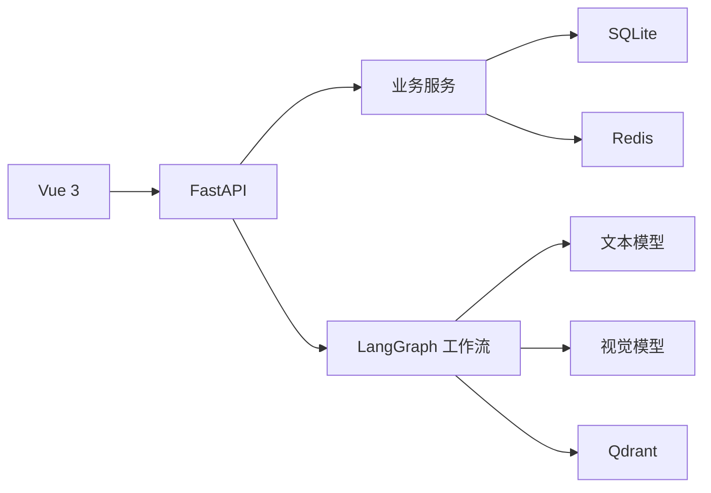

# 至道

至道是一个面向个性化学习场景的多智能体学习平台。系统以学习笔记本为核心，通过学习画像、资料检索和资源生成，为不同学习目标组织内容与练习。

## 功能

- 为课程或知识主题创建独立学习笔记本
- 根据对话持续更新七维学习画像
- 上传 PDF 资料并通过 Qdrant 检索相关内容
- 在对话中上传图片，由视觉模型解析后交给文本模型处理
- 生成学习路径、学习指南、报告、思维导图、闪卡、测验、数据表格和代码练习
- 对生成内容进行独立质检与有限次数重试
- 提交测验后生成复盘并更新学习画像
- 发布、搜索、评论和点赞学习论坛帖子

## 架构



中央对话工作流负责画像分析、模型决策、知识检索和 Studio 工具调用。Studio 工作流根据资源类型选择生成工具，并将结果交给质检节点处理。

## 技术栈

| 模块 | 技术 |
| --- | --- |
| 前端 | Vue 3、Vite、Element Plus、Axios、Markdown-It、Mermaid |
| 后端 | Python 3.14、FastAPI、Pydantic、SQLAlchemy、aiosqlite |
| 工作流 | LangChain Core、LangChain OpenAI、LangGraph |
| 数据 | SQLite、Redis、Qdrant |
| 文档处理 | PyPDF、PyMuPDF、Sentence Transformers、BGE |
| 工程 | uv、npm、Docker Compose、pytest、Ruff |

## 快速启动

### Docker Compose

复制环境变量模板：

```powershell
Copy-Item .env.example .env
```

生成 JWT 密钥并写入 `.env` 的 `SECRET_KEY`：

```powershell
python -c "import secrets; print(secrets.token_urlsafe(48))"
```

根据需要填写模型和 SMTP 配置，然后启动服务：

```powershell
docker compose up -d
```

| 服务 | 地址 |
| --- | --- |
| 前端 | `http://localhost:5173` |
| 后端 API | `http://localhost:8080/api` |
| Swagger | `http://localhost:8080/docs` |
| Qdrant 控制台 | `http://localhost:6333/dashboard` |

查看日志或停止服务：

```powershell
docker compose logs --follow backend frontend
docker compose down
```

### 本地开发

先启动 Redis 和 Qdrant：

```powershell
docker compose up -d redis qdrant
```

启动后端：

```powershell
uv sync
uv run uvicorn main:app --host 0.0.0.0 --port 8080 --reload
```

另开终端启动前端：

```powershell
Set-Location fronted
Copy-Item .env.example .env.local
npm ci
npm run dev
```

## 环境变量

完整配置见 [`.env.example`](.env.example)。

| 变量 | 用途 |
| --- | --- |
| `SECRET_KEY` | JWT 签名密钥，必填 |
| `DEEPSEEK_APIKEY` | 文本模型 API Key |
| `DEEPSEEK_BASE_URL` | 文本模型 API 地址 |
| `DEEPSEEK_MODEL` | 文本模型名称 |
| `VISION_APIKEY` | 视觉模型 API Key |
| `VISION_BASE_URL` | 视觉模型 API 地址 |
| `VISION_MODEL` | 视觉模型名称 |
| `SMTP_USER` / `SMTP_KEY` | 注册和邮箱验证码登录 |
| `DATABASE_URL` | SQLAlchemy 异步数据库地址 |
| `REDIS_*` | Redis 连接与验证码配置 |
| `QDRANT_*` | Qdrant 地址和基础集合配置 |
| `KNOWLEDGE_*` | PDF 数量、大小、嵌入模型和设备配置 |

## 项目结构

```text
.
├─ app/
│  ├─ agent/          # 模型客户端、工具和工作流
│  ├─ api/            # FastAPI 路由
│  ├─ core/           # 配置与 Redis 客户端
│  ├─ db/             # 数据模型、仓储和数据库初始化
│  ├─ schemas/        # 请求与响应模型
│  ├─ service/        # 业务服务
│  └─ utils/          # 认证、附件和错误处理
├─ fronted/           # Vue 前端
├─ tests/             # 后端与工作流测试
├─ .env.example       # 环境变量模板
├─ docker-compose.yml
├─ main.py
└─ pyproject.toml
```

Agent 模块的职责与扩展约定见 [`app/agent/README.md`](app/agent/README.md)。

## 测试

```powershell
uv run pytest
uv run ruff check .
```

```powershell
Set-Location fronted
npm run build
```

## 许可证

本项目使用 [MIT License](LICENSE)。
